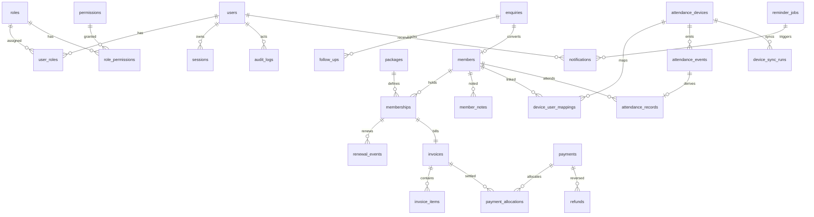

# Database ERD (Phase 0 plan — implemented in Phase 1 Prisma schema)

Tables: users, roles, permissions, user_roles, role_permissions, sessions, members, member_notes, enquiries, follow_ups, packages, memberships, renewal_events, membership_status_history, invoices, invoice_items, payments, payment_allocations, refunds, credit_adjustments, attendance_devices, device_user_mappings, attendance_events, attendance_records, device_sync_runs, reminder_jobs, notifications, audit_logs, system_job_runs.
